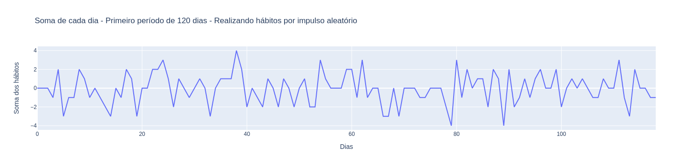
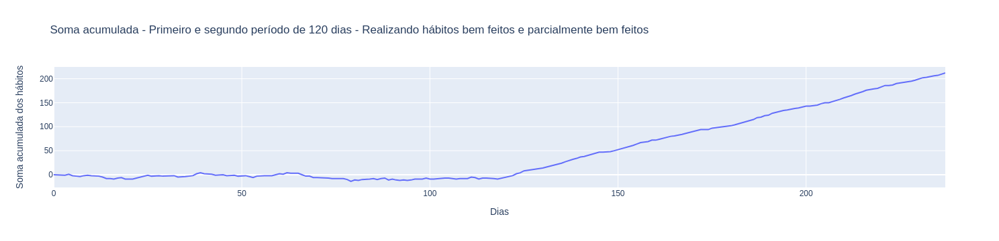
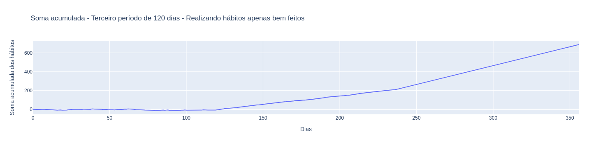
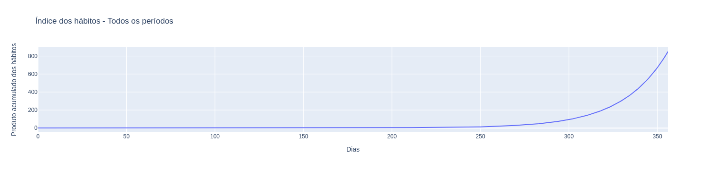

---
jupyter:
  kernelspec:
    display_name: Python 3 (ipykernel)
    language: python
    name: python3
  language_info:
    codemirror_mode:
      name: ipython
      version: 3
    file_extension: .py
    mimetype: text/x-python
    name: python
    nbconvert_exporter: python
    pygments_lexer: ipython3
    version: 3.12.2
  nbformat: 4
  nbformat_minor: 5
---

<div id="28b30acb-3d68-4050-8e44-04cb1a8d37f7" class="cell markdown">

# Juros compostos dos hábitos saudáveis - Simulação

Imagine que você tem um caderno onde anota todos os dias como você
realizou os hábitos que você deseja manter ou construir, dando os
números:

- 1 para a realização bem feita
- 0 para realização parcialmente bem feita
- -1 para não realizou ou fez o contrário do que pretendia

Então, vamos simular um ano qualquer da sua vida dividido em 3 períodos
de 120 dias, calculando a realização dos seguintes hábitos:

- Praticar exercício físico todos os dias, 1h por dia, antes das 8h
- Se alimentar de comida saudável em horários regulares
- Dormir e acordar em horários fixos mais de 7h por noite
- Manter o foco na realização de suas tarefas, evitando distrações como
  redes sociais

Sendo os períodos acontecendo da seguinte forma:

1.  Você realiza esses hábitos só quando lhe dá vontade, apenas por
    impulso
2.  Você decide que irá fazer, mesmo que parcialmente bem feito cada
    hábito todos os dias
3.  Você toma a atitude de realizar todos os hábitos de forma idealmente
    como planejou

Por fim, você realiza a soma desses números ao final de cada dia e
adiciona ao resultado de todos os dias, gerando a soma acumulada (no
final transformamos usamos a multiplicação).

</div>

<div id="fcb3e1c9-69e4-4d33-a580-c1fedaf4b63e" class="cell code"
execution_count="19">

``` python
import pandas as pd
from random import randint
import plotly.express as px
```

</div>

<div id="acbc78ee-43b9-42e6-bfe3-0a7e6590f84b" class="cell code"
execution_count="20">

``` python
habitos = pd.DataFrame(columns=['exercicio_fisico', 'alimentacao_saudavel', 'sono_adequado', 'foco_tarefas'])

exercicio = []
alimentacao = []
sono = []
foco = []

# Atribui números inteiros aleatórios entre -1 e 1, 120 vezes
for i in range(1, 120):
    exercicio.append(randint(-1, 1))
    alimentacao.append(randint(-1, 1))
    sono.append(randint(-1, 1))
    foco.append(randint(-1, 1))
    
habitos['exercicio_fisico'] = exercicio
habitos['alimentacao_saudavel'] = alimentacao
habitos['sono_adequado'] = sono
habitos['foco_tarefas'] = foco

habitos['soma'] = habitos.sum(axis=1)
habitos['soma_acum'] = habitos['soma'].cumsum()
```

</div>

<div id="83011c79-44c6-47c2-8399-4fa359474171" class="cell code"
execution_count="21">

``` python
px.line(habitos, x=habitos.index, y=habitos['soma'], 
        labels={'index':'Dias', 'soma':'Soma dos hábitos'}, 
        title='Soma de cada dia - Primeiro período de 120 dias - Realizando hábitos por impulso aleatório')
```

<div class="output display_data">



</div>

</div>

<div id="89680b89-b818-49f5-944b-98530a7bec40" class="cell code"
execution_count="22">

``` python
habitos = pd.DataFrame(columns=['exercicio_fisico', 'alimentacao_saudavel', 'sono_adequado', 'foco_tarefas'])

# Atribui aleatoriamente 0 ou 1, 120 vezes
for i in range(1, 120):
    exercicio.append(randint(0,1))
    alimentacao.append(randint(0,1))
    sono.append(randint(0,1))
    foco.append(randint(0,1))
    
habitos['exercicio_fisico'] = exercicio
habitos['alimentacao_saudavel'] = alimentacao
habitos['sono_adequado'] = sono
habitos['foco_tarefas'] = foco

habitos['soma'] = habitos.sum(axis=1)
habitos['soma_acum'] = habitos['soma'].cumsum()
```

</div>

<div id="b39ec950-6548-4da5-8c7b-40af2ab7c6a3" class="cell code"
execution_count="23">

``` python
px.line(habitos, x=habitos.index, y=habitos['soma_acum'], labels={'index':'Dias', 'soma_acum':'Soma acumulada dos hábitos'}, title='Soma acumulada - Primeiro e segundo período de 120 dias - Realizando hábitos bem feitos e parcialmente bem feitos')
```

<div class="output display_data">



</div>

</div>

<div id="7791ac5f-65cc-4233-875b-5b3d3093a4f5" class="cell code"
execution_count="24">

``` python
habitos = pd.DataFrame(columns=['exercicio_fisico', 'alimentacao_saudavel', 'sono_adequado', 'foco_tarefas'])

#Atribui 1, 120 vezes
for i in range(1, 120):
    exercicio.append(1)
    alimentacao.append(1)
    sono.append(1)
    foco.append(1)
    
habitos['exercicio_fisico'] = exercicio
habitos['alimentacao_saudavel'] = alimentacao
habitos['sono_adequado'] = sono
habitos['foco_tarefas'] = foco

habitos['soma'] = habitos.sum(axis=1)
habitos['soma_acum'] = habitos['soma'].cumsum()
```

</div>

<div id="0e1887a8-d6ec-4615-9ae0-877ced1dcc33" class="cell code"
execution_count="25">

``` python
px.line(habitos, x=habitos.index, y=habitos['soma_acum'],
        labels={'index':'Dias', 'soma_acum':'Soma acumulada dos hábitos'}, 
        title='Soma acumulada - Terceiro período de 120 dias - Realizando hábitos apenas bem feitos')
```

<div class="output display_data">



</div>

</div>

<div id="c9eabea9-3e0f-4e49-9c6c-bf2ecdef345d" class="cell markdown">

## Transformando a soma em um índice e fazendo a multiplicação de cada dia

</div>

<div id="eb2442c7-637d-4bb6-95d2-ce504065e66c" class="cell code"
execution_count="26">

``` python
habitos['var'] = (habitos['soma'] + 100) / 100
habitos['acumulado'] = habitos['var'].cumprod()
```

</div>

<div id="d5423dbb-f377-42ad-9f81-5337ac0fe427" class="cell code"
execution_count="27">

``` python
px.line(habitos, x=habitos.index, y=habitos['acumulado'],
        labels={'index':'Dias', 'acumulado':'Produto acumulado dos hábitos'}, 
        title='Índice dos hábitos - Todos os períodos')
```

<div class="output display_data">



</div>

</div>

<div id="3821a675-4eaf-4eb6-ab28-673ec4cb1ea2" class="cell markdown">

Se você deseja mudar seus hábitos, deseja sair de onde você está e ir
para outro patamar, esse é um exercício que visa mostrar que fazer algo
diferente pode levar a resultados diferentes.

</div>
